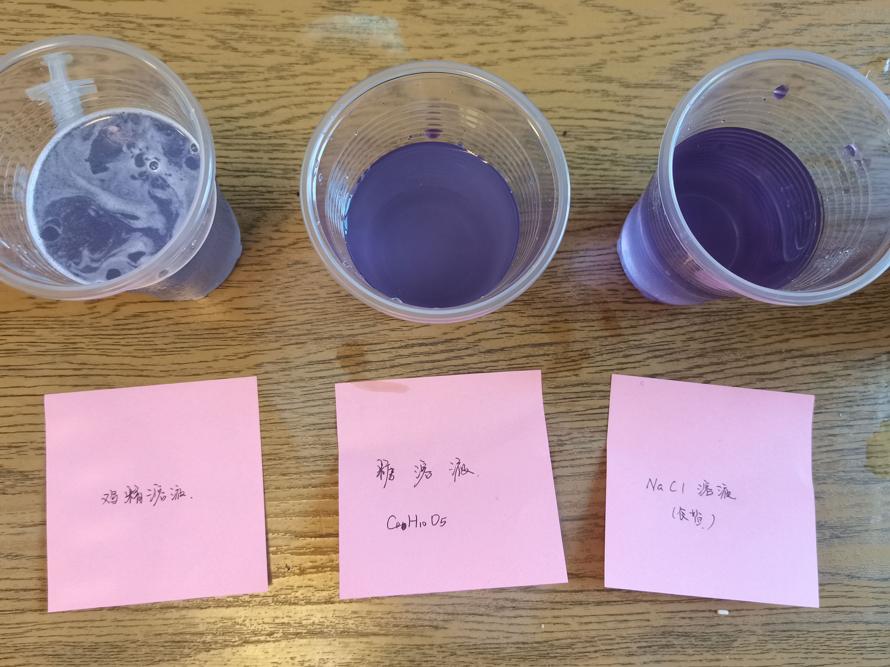

# 使用指示剂测试家里面其他物品的酸碱性（探究）

使用 **紫甘蓝溶液** 作为酸碱指示剂，因为其颜色分明而且辨析度高。

1. 将紫甘蓝溶液滴入食盐水溶液中($\text{NaCl}$)，发现呈现紫色
2. 将紫甘蓝溶液滴入糖水溶液中($\text{C}_{\text{6} }\text{H} _{10}\text{O} _\text{5}$)，发现略微呈现蓝色（主体为紫色）
3. 将紫甘蓝溶液滴入鸡精溶液中(略 ~~(是我不会)~~ )，发现呈现蓝色

因此，可以（粗略地）得出，
食盐水溶液呈**中性**，糖水溶液呈**弱碱性**，鸡精溶液呈**碱性**。

> 如果觉得不对应该是拍照视角不好， ~~把屏幕扭一下（bushi~~
> （逃

---