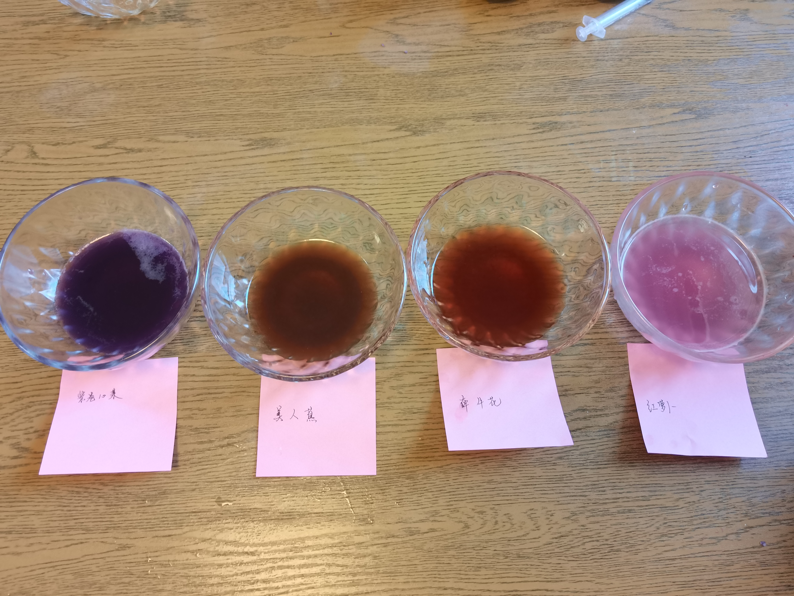

# 自制酸碱指示剂并且验证

实验准备：一个紫甘蓝，几朵牵牛花、美人蕉和一个红萝卜。
以及，4个针筒、4个小碗和20个杯子。
盐，糖还有鸡精。
一瓶白醋，一包小苏打，一瓶矿泉水

首先，将紫甘蓝和红萝卜剥皮、摘下牵牛花和美人蕉的花瓣。将其各自捣碎，如果可以放到榨汁机里面兑少量水（或兑少量水后使用擀面杖捣碎），各自过滤放到各自的碗里，贴好标签。

以**紫甘蓝**、**牵牛花**、**红萝卜**、**美人蕉**的顺序排列3个小碗。

将白醋和矿泉水分别倒入一个空杯子，约4/5处。

在第三个杯子中，放入小苏打，并且倒入水，搅拌至全部溶解。

以**白醋**、**小苏打水**和**矿泉水**的顺序排列3个杯子。

### 紫甘蓝作为酸碱指示剂

将 3 个杯子中的液体分别取约 1/4 倒入一个空杯。

将紫甘蓝汁使用针筒吸收至针筒 1/3 处，滴入白醋中。
再取 1/3 筒，滴入苏打水溶液中。
再取 1/3 筒，滴入矿泉水中。

以上操作执行 3 次，发现：

1. 原来透明的白醋变成了粉红色
2. 原来透明的苏打水变成了青绿色
3. 原来透明的矿泉水变成了紫色

---

使用**牵牛花**、**红萝卜**、**美人蕉**按照上述步骤操作，发现：

| 植物 | 原来溶液颜色 | 滴入白醋中后 | 滴入苏打水中后 | 滴入矿泉水中后 |
| ---- | ---- | ---- | ---- | ---- |
| 紫甘蓝 | 紫色 | 粉红色 | 青绿色 | 紫色 |
| 牵牛花 | 棕红色 | 嫩红色 | 茶绿色 | 淡棕色 |
| 红萝卜 | 淡粉色 | 粉红色 | 白色（微紫） | 淡粉色 |
| 美人蕉 | 褐色 | 淡褐色 | 茶褐色 | 褐色 |

