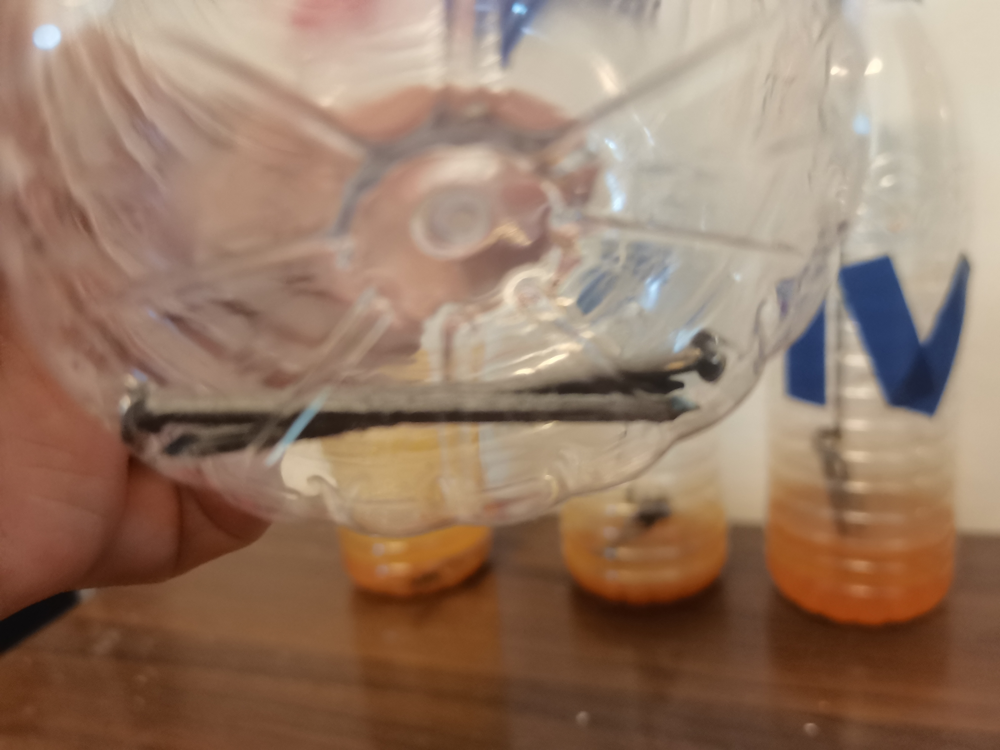
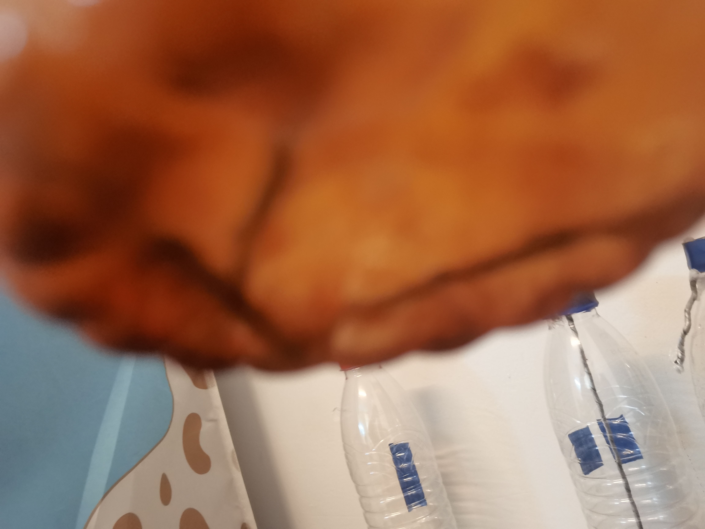
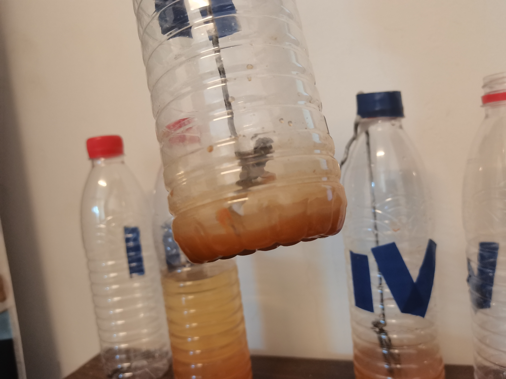
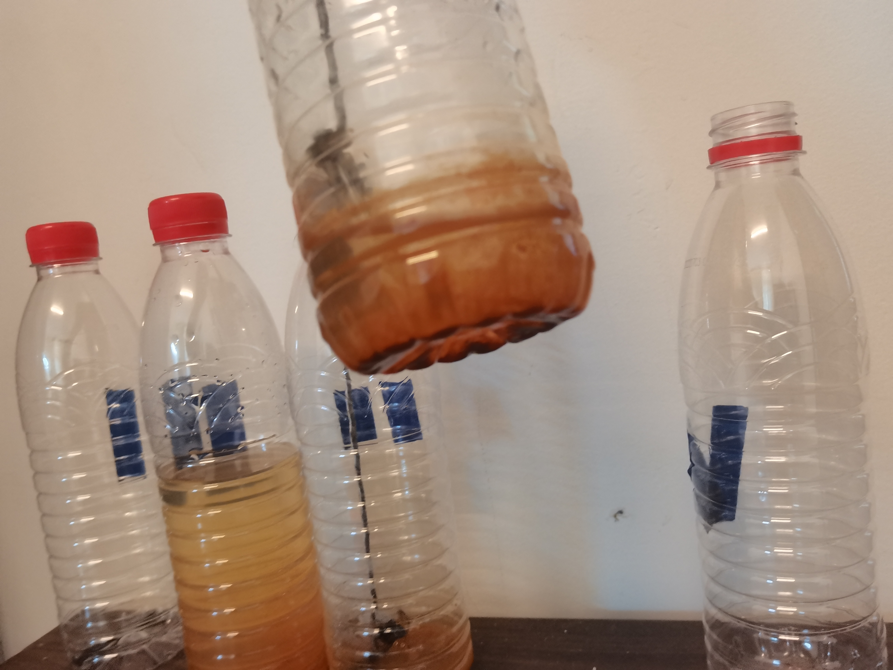
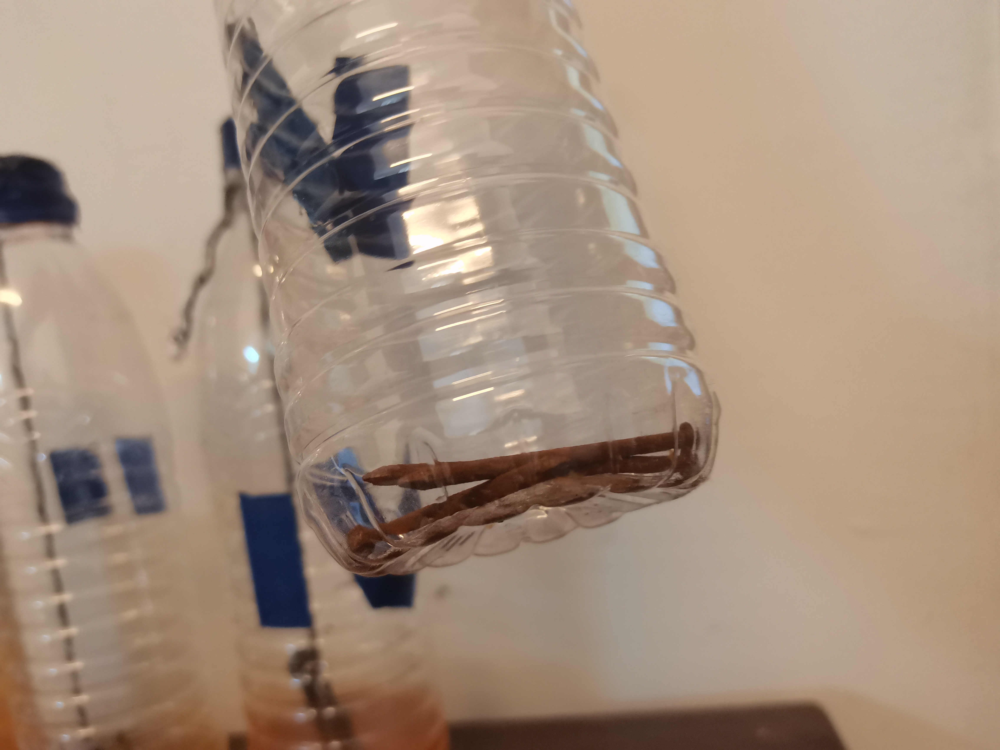

# 观察结果

| 天数 | 第一个瓶子 | 第二个瓶子 | 第三个瓶子 | 第四个瓶子 | 第五个瓶子 |
| ---- | ---------- | ---------- | ---------- | ---------- | ---------- |
| 第一天 | 没有生锈 | 基本没有生锈 | 浸入水中的部分开始生锈 | 浸入水中的部分略微生锈 | 完全生锈 |
| 第二天 | 没有生锈 | 部分生锈 | 浸入水中的部分部分生锈 | 浸入水中的部分开始生锈 | 完全生锈 |
| 第三天 | 没有生锈 | 部分生锈 | 浸入水中的部分部分生锈 | 浸入水中的部分部分生锈 | 完全生锈 |
| 第四天 | 没有生锈 | 部分生锈 | 浸入水中的部分几乎全锈 | 浸入水中的部分部分生锈 | 完全生锈 |
| 第五天 | 基本没有生锈 | 基本生锈 | 浸入水中的部分全锈 | 浸入水中的部分几乎全锈 | 完全生锈 |
| 第六天 | 基本没有生锈 | 基本生锈 | 浸入水中的部分全锈 | 浸入水中的部分几乎全锈 | 完全生锈 |
| 第七天 | 基本没有生锈 | 完全生锈 | 浸入水中的部分全锈 | 浸入水中的部分全锈 | 完全生锈 |

其中，铁钉的环境如实验介绍所说。

得出，洁净的铁钉的生锈需要空气和水分。如果没有足够的水分，铁钉生锈速度极慢甚至无法生锈。
同时，盐水的生锈速度比清水慢。
但是经过浸泡后的铁钉生锈速度远大于洁净（的铁钉）。

实验结果图

| 第一个瓶子 | 第二个瓶子 | 第三个瓶子 | 第四个瓶子 | 第五个瓶子 |
| ---------- | ---------- | ---------- | ---------- | ---------- |
|  |  |  |  |  |