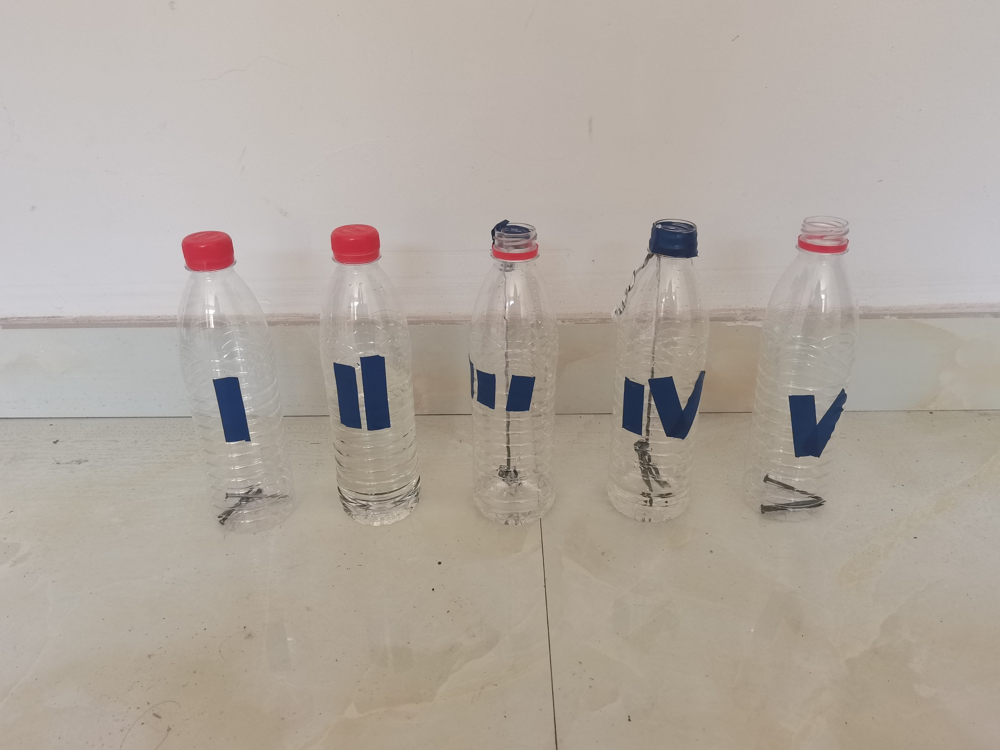

# 实验准备

1. 5个空瓶
2. 15个铁钉
3. 2根绳子
4. 一点点食盐溶液
5. 一点点白醋

## 实验准备步骤

将 5 个瓶子按照 (I, II, III, IV, V) 的顺序使用蓝色胶带标记。

| 瓶子 | 内容 |
| ---- | ---- |
| I | 把洁净的铁钉放在干燥的矿泉水瓶里，拧紧瓶口 |
| II | 把洁净的铁钉全部浸没在盛满煮沸过的水中的矿泉水瓶里，拧紧瓶口 |
| III | 把洁净的铁钉放在盛有煮沸过的水中的矿泉水瓶中，一半浸入水中，把瓶口敞口放置 |
| IV | 把洁净的铁钉放在盛有食盐水的矿泉水瓶中，一半浸入水中，把瓶口敞口放置 ~~（家里没有试管qwq~~ |
| V | 把用白醋浸过的铁钉放在干燥的矿泉水瓶中，把瓶口敞口放置 |

其中，(III, IV)组使用绳子系在瓶口吊着。每组放置相同的 3 枚铁钉。

